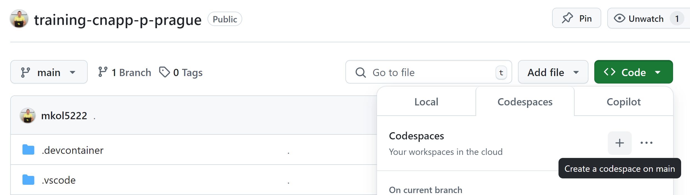
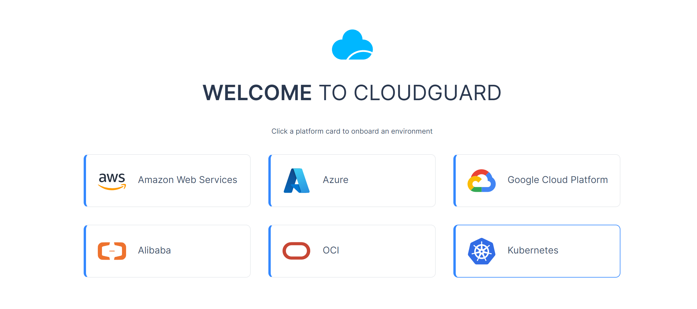
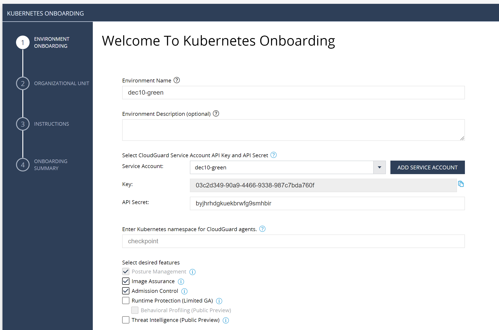
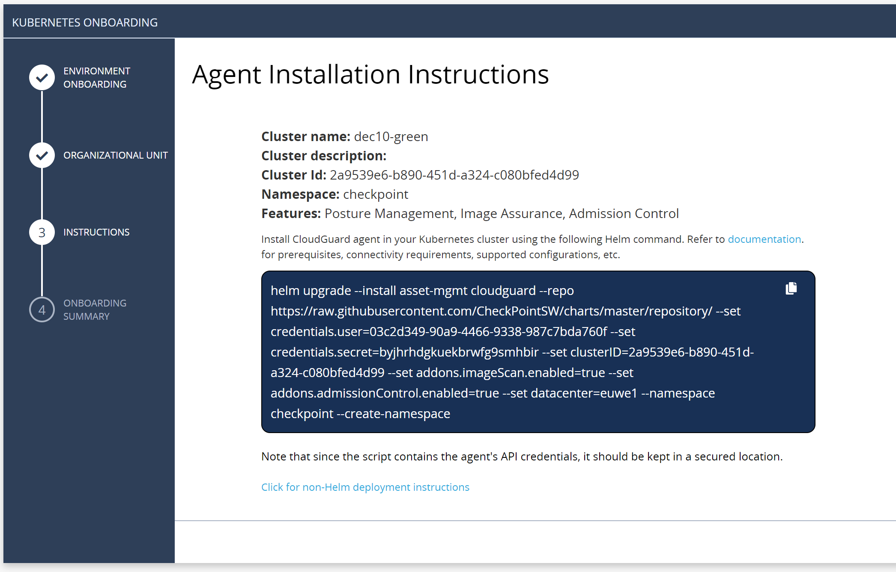
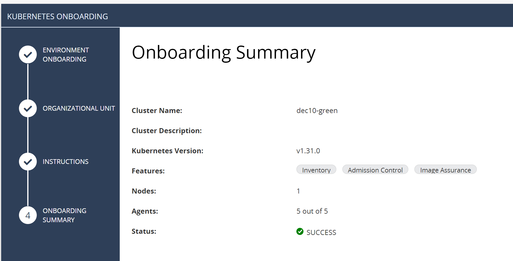

# Kubernetes Security


### Preparation

* login to Github
* visit repo [home](https://github.com/mkol5222/training-cnapp-p-prague)
* open Codespace on this repo - green button `Code` / Codespaces tab / create new with `+` button
* use VScode in web page or consider opening in local VScode app



* Codespace is dedicated Linux machine
* this is how you introduce Kubernetes cluster on it with commands:

```shell
# make our cluster
minikube start --driver docker

# check our cluster
kubectl get no
minikube status
```

### On-boarding cluster to CloudGuard CNAPP

Navigate to `training-cnapp+p-prague` Infinity Portal tenant
and choose CloudGuard pillar with `CSPM - Posture Management` entry.
Click [On-boarding](https://portal.checkpoint.com/dashboard/cloudguard#/cloud-onboarding) and choose `Kubernetes`.



* Name environment based on today (`dec10`) and your lab alias provided earlier (e.g. `green`): `dec10-green`.

* Click `Add Service Account` and name it again with name matching environment (e.g. `dec10-green`)
API key and secret will later be part of installation command.

* Keep default namespace - `checkpoint`

* Make sure to check only following components, exactly matching screenshot:
    * Posture Management
    * Image Assurance
    * Admission Control



Next.

* Keep default OU hierarchy, add enviromnent as selected.

Next

* You have reached `Agent Installation Instructions` with command to on-board your cluster



* Lets run the command in Kubernetes command line to on-board cluster to CNAPP (use your own command with correct credentials and cluster ID as show in wizard):

```shell
# use real command from YOUR wizard
helm upgrade --install asset-mgmt cloudguard --repo https://raw.githubusercontent.com/CheckPointSW/charts/master/repository/ --set credentials.user=03c2d349-90a9-4466-9338-987c7bda760f --set credentials.secret=byjhrhdgkuekbrwfg9smhbir --set clusterID=2a9539e6-b890-451d-a324-c080bfed4d99 --set addons.imageScan.enabled=true --set addons.admissionControl.enabled=true --set datacenter=euwe1  --namespace checkpoint --create-namespace

# check if all is running
watch -d kubectl get all -n checkpoint
```

Next.

* Wizard is waiting for all components to "call home" to show deployment success (5 of 5 agents done, status Success)

Finish.




# Image scan
```shell
# to get scan result we have selected old version of NGINX image from 2016: https://hub.docker.com/layers/library/nginx/1.11.7-alpine/images/sha256-78e07921f4ab58e6eff8e5c390c90d96de112feab23c284523371c155478ccd6?context=explore

# lets give platform chance to scan it before we return to details later
# notice pods are started in default namespace
kubectl create deploy web --image nginx:1.11.7-alpine
# we will revisit this later
```

# Admission control

```shell
# optional - monitor when new Admission policy is fetched - hash will change
 watch -d 'kubectl -n checkpoint logs deployment.apps/asset-mgmt-admission-policy | grep Hash | tail -4'

# create enforced ns web and not limited ns freedom
kubectl create ns web
kubectl create ns freedom

# in freedom - deployment is finished
kubectl create deploy web -n freedom --image nginx:1.11.7-alpine
kubectl get po -n freedom --watch
# optional - delete deployment
kubectl delete -n freedom deploy/web

# what if we try in enforced NS web?
kubectl create deploy web -n web --image nginx:1.11.7-alpine
# ERROR
# error: failed to create deployment: admission webhook "cloudguard-enforcer-webhook.cloudguard.checkpoint.com" denied the request: [CloudGuard] The request has been blocked according to the GSL rule: 'web Chain of Trust Protection – Images must be deployed from a pre-defined list of registries'

# check NS
kubectl get all -n web
# No resources found in web namespace.
```

