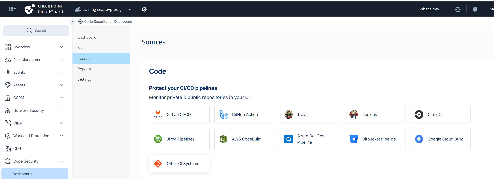
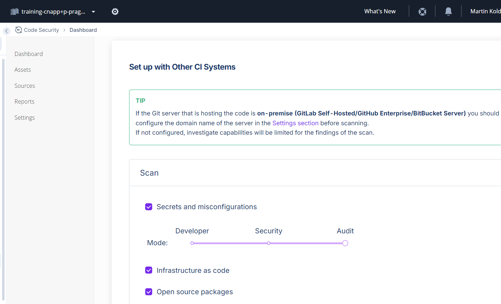
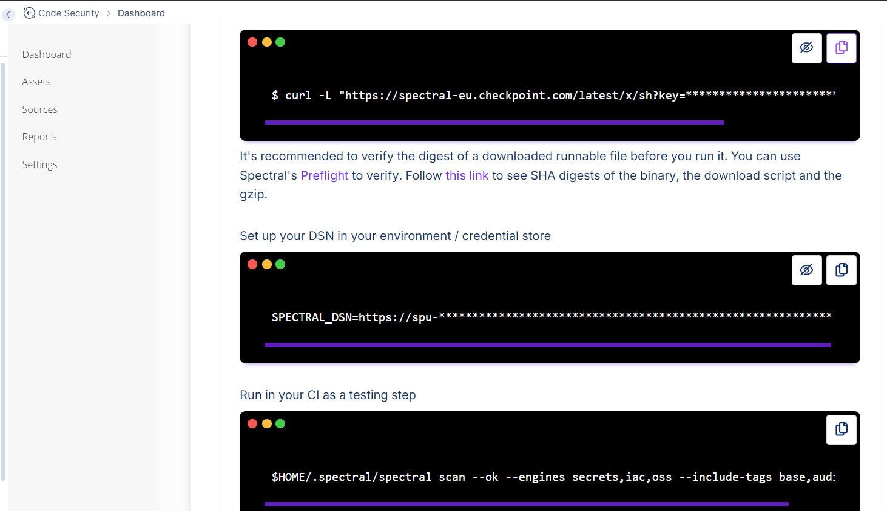
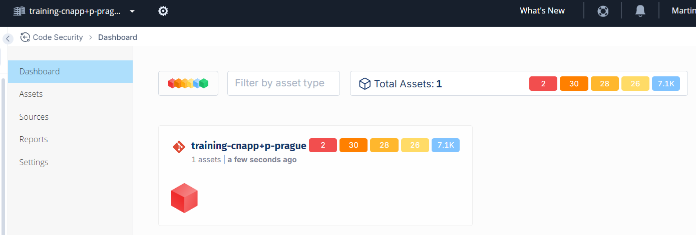
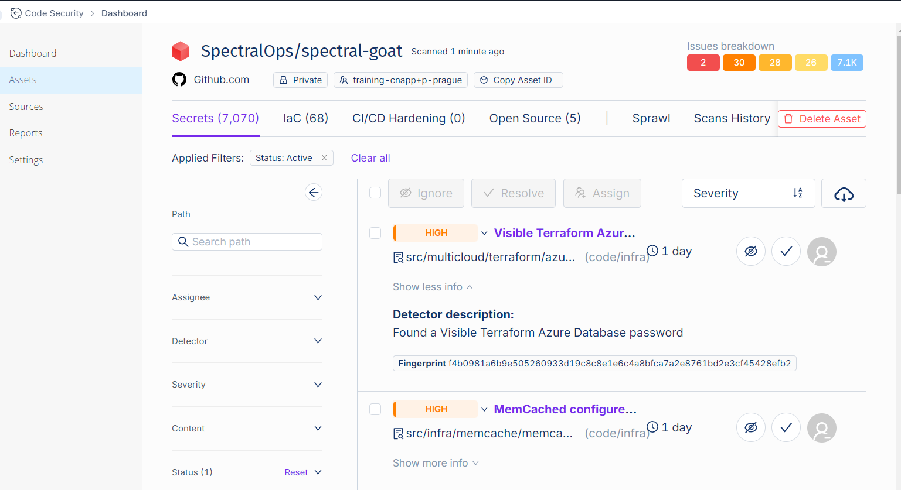
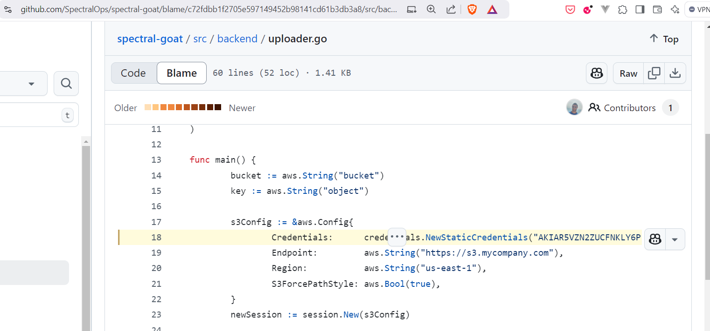

# Code Security lab

We assume that you are already using this lab in Github Codespace similar to Kubernetes Security lab.

### Demo repository

We have created demonstration [repository](https://github.com/SpectralOps/spectral-goat) that will produce various type of findings in all categories: secrets, IaC and dependencies CVEs.

Lets clone demo source repository to local temporary folder.

```shell
# create and visit tmp folder in one step
cd $(mktemp -d)
# clone demo repository
git clone https://github.com/SpectralOps/spectral-goat

# change to repo
cd spectral-goat; ls -la
```

### Code Security configuration in CNAPP

Lets open [Infinity Portal](https://portal.checkpoint.com/) for tenant `training-cnapp+p-prague` and navigate to [Code Security section](https://portal.checkpoint.com/dashboard/cloudguard#/shiftleft-redirect)



We are scanning new subject - adding new source to console.
Select `Sources` and use instructions for `Other CI Systems` that will guide us how to get command line scanner and do the scan. It based on credentials for your tenant called `DSN` 



* first we enable `Audit` level and choose all engines including `Infrastructire as code` and `Open source packages` (CVEs from code supply chain)



* next we download command line scanner and set credentials enabling scans:

```shell
# copy with your own code
curl -L "https://spectral-eu.checkpoint.com/latest/x/sh?key=spu-BringYourOwn" | sh
# now spectral binary resides in ~/.spectral/spectral
ls -la .spectral/spectral

# it requires credential stored in env variable
# IMPORTANT prefix command variable from portal with export to make it available for child processes
export SPECTRAL_DSN=https://spu-BringYourOwn@spectral-eu.checkpoint.com

# now we are ready to execute the scan and later review results in portal and local console
$HOME/.spectral/spectral scan --ok --engines secrets,iac,oss --include-tags base,audit3,iac
```

### Results in (CNAPP) management console

Findings are presented in [Code Security section](https://portal.checkpoint.com/dashboard/cloudguard#/shiftleft-redirect) under Assets:



Look under each category: Secrets, IaC and Open Source.
Notice that secrets are not harvested into security tool database, but finding includes link to source code specific line to verify incident.



Source code reference:



### Scan repository on Github based on Github API with personal access token

Repo or whole Github/Gitlab org/user can be scanned also remotely without cloning to local filesystem first.

Visit `103-gh-token.sh` on training dashboard behind `bit.ly/cp-cna***-training` link and obtain token value similar to:

```shell
# set real secret
export GHPAT="YOUR_REAL_VALUE_FROM_ABOVE"

# scan repo remotely without cloning
 $HOME/.spectral/spectral github -k repo -t "$GHPAT" https://github.com/defencedigital/moduk-frontend --engines secrets,iac,oss --include-tags base,audit3,iac

# and now find in asserts in Code Security portal of your CNAPP tenant
```

### Summary

We have seen how Code Security tool is downloaded and conected to tenant using DSN credential.
We were able to scan local repository and remote repo using Github API.

Learn more about additional code scan options with:
```shell
 $HOME/.spectral/spectral --help
 ```