# CloudGuard WAF

CloudGuard WAF is managed from dedicated Infinity Portal [section](https://portal.checkpoint.com/dashboard/appsec/cloudguardwaf#/waf-policy/getting-started). Open it for tenant `training-cnapp+p-prague`

WAF has multiple deployment options called `Profiles` - including managed service (SaaS), WAF VM, VMSS/ASG, Docker container, Kubernetes container or Ingress, native NGINX embedded install and more.

Web applications are defined as `Assets` with specific security practices and configuration data to be enforced on specific `profile` - used to install one or many WAF `Agents`.

### Lab deployment

[Profiles section](https://portal.checkpoint.com/dashboard/appsec/cloudguardwaf#/waf-policy/profiles/) has preconfigured profile `waf` for you. I was already used to deploy existing VM in Azure running on FQDN `wafservice-prg-training.westeurope.cloudapp.azure.com` which can be used as alias(CNAME) for real services e.g. `notpink.lab.klaud.online`.

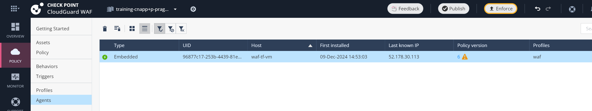

So you do not need to worry about enforcement part - VM is running for you and it was even provided with valid wildcard certificate `*.lab.klaud.online` to make HTTPS setup of our color assets/web apps easy.

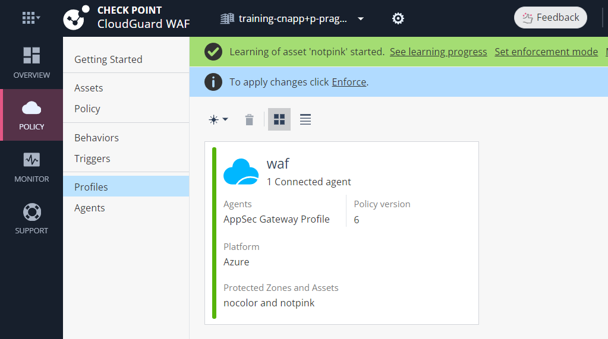

### Knowing the environment

We are going to publish existing unprotected web application [ifconfig.me](https://ifconfig.me) under own URL based on your assigned alias - color - e.g. `https://pink.lab.klaud.online`.

DNS record (CNAME type) is already pointing from your color domain to WAF's FQDN `wafservice-prg-training.westeurope.cloudapp.azure.com`.

Lets verify it:

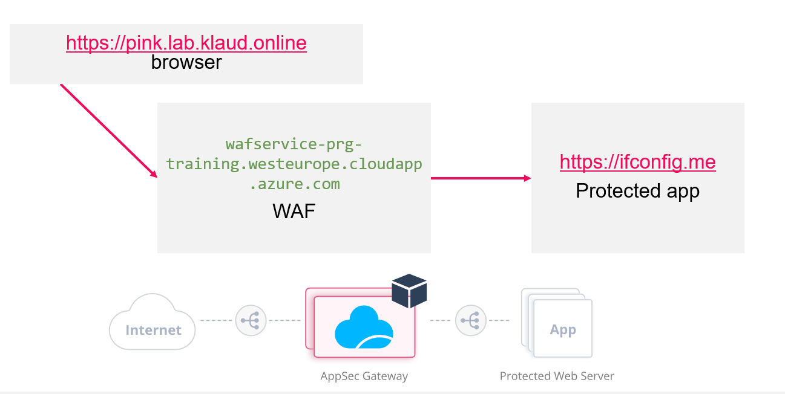
```shell
# install dig
sudo apt update; sudo apt install dnsutils -y

# check app to be protectected
curl https://ifconfig.me; echo
# try https://ifconfig.me also in browser - it has richer data for you

# notice that fake attack is still reaching the service
curl 'https://ifconfig.me?z=cat+/etc/passwd'
# server returned your source IP as usual

# find your alias-color in training dashboard - on bit.ly/cp-cna***-training link
# e.g. "notpink" - use YOUR color below

# verify DNS pointing to WAF platform
dig notpink.lab.klaud.online
# return just values:
dig notpink.lab.klaud.online +short
# CNAME for wafservice-prg-training.westeurope.cloudapp.azure.com. - with IP of VM 52.178.30.113

# once configured, WAF will behive as your app - will show source IP of request
curl -vvv -k https://notpink.lab.klaud.online; echo
# but before WAF asset is configured - it is not handled by reverse proxy (WAF)
curl -vvv  http://red.lab.klaud.online
# empty response for unhandled server

# this is how we get PREVENTED incident, once we have own asset (notpink is just sample)
curl -vvv -k 'https://notpink.lab.klaud.online/?z=cat+/etc/passwd' 

curl -vvv -k 'https://notpink.lab.klaud.online/?z=cat+/etc/passwd' | grep 'Incident Id.*</p'

# look for incident ID in portal Monitor section
# https://portal.checkpoint.com/dashboard/appsec/cloudguardwaf#/waf-monitor/high-and-critical-wlc/
```

### Configuring your own asset

Lets start in [Getting started](https://portal.checkpoint.com/dashboard/appsec/cloudguardwaf#/waf-policy/getting-started) - add new web application asset with Wizard:

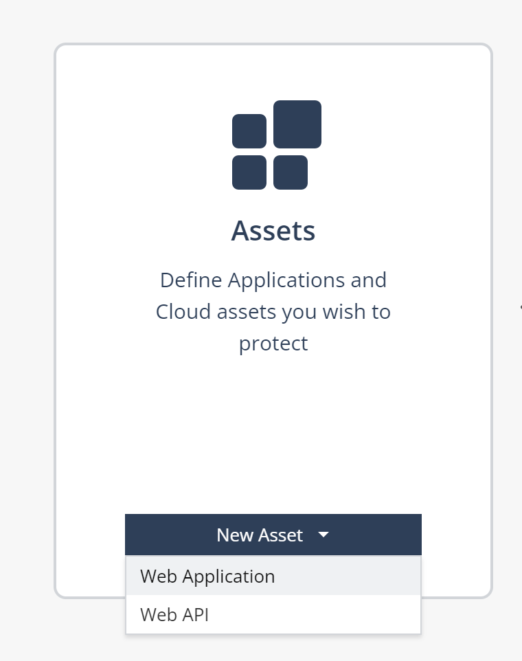

Some initial information includes:

* `Name:` matching your web app domain derived from color - e.g. pink: `pink.lab.klaud.online`

* `Users will access the application at these URLs (1):` add both HTTP and HTTPs application URLs based on your color without trailing forward slash: `http://pink.lab.klaud.online` and `https://pink.lab.klaud.online`

* `WAF / Reverse Proxy / Ingress will reach the application in this URL (2):` - use real protected aplication location without trailing forward slash = `https://ifconfig.me` 

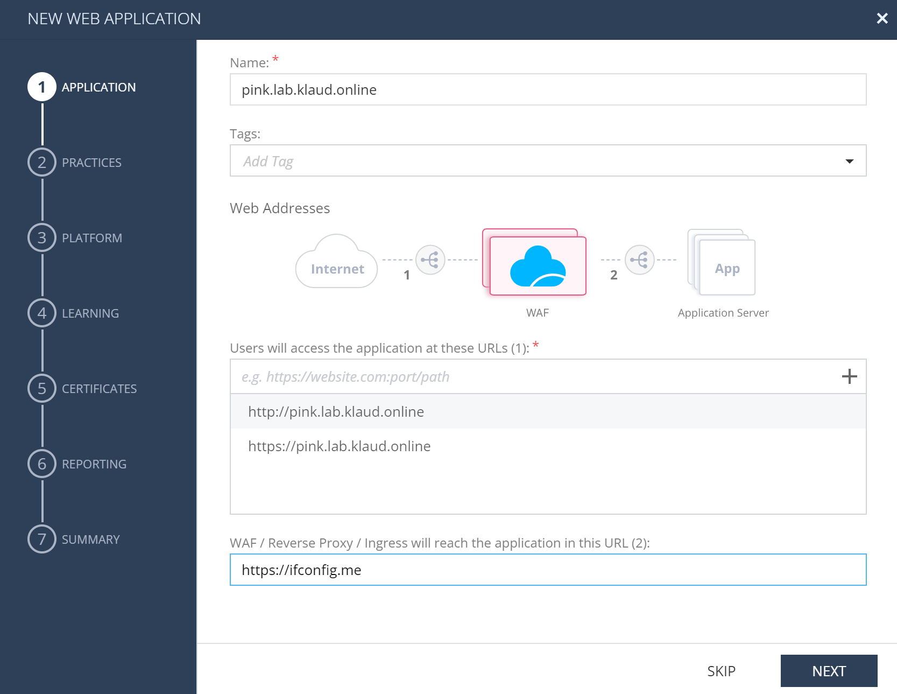

* You would use `Learn / Detect` in real world, but we are chooding `Prevent` for both ML based and signature based engines:

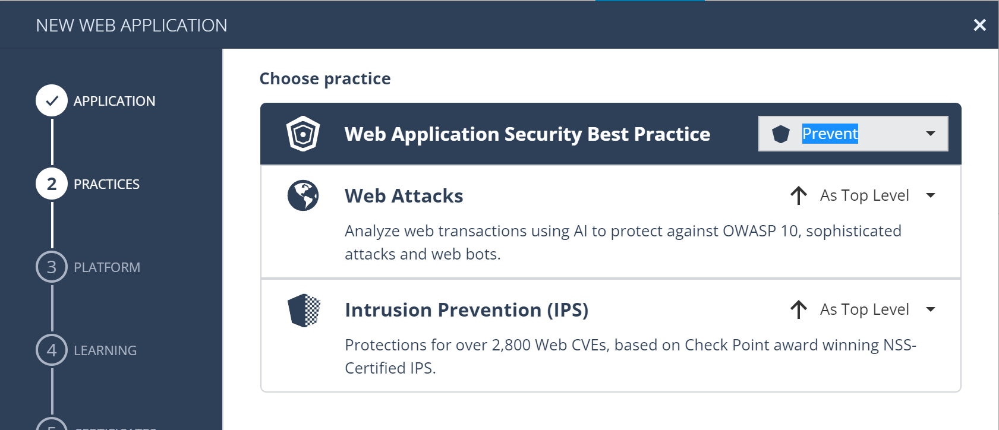

* We have existing profile `waf` with VM installed, choose it:

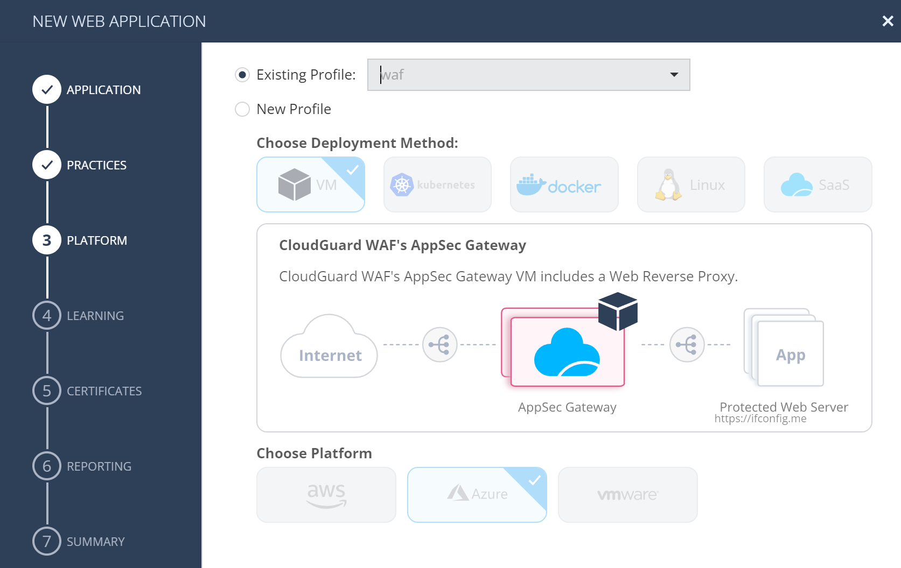

* VM has visibility of real source IP address of requesrs, so we stick to `Source IP address`

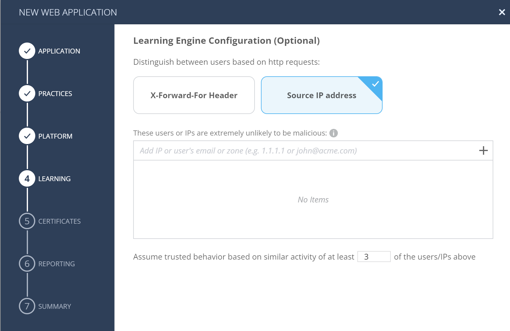

* Valid certificates are already issued and preinstalled on VM - choose all defaults and finish the wizard, creating the asset.

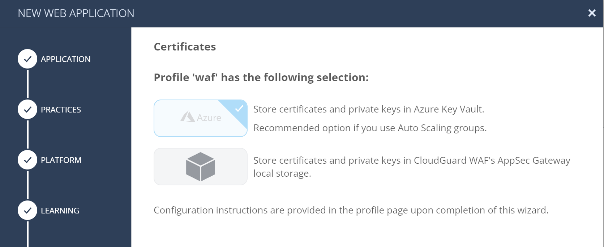


### Customize asset reverse proxy settings to pass expected Host header

Because we are publishing `ifconfig.me` as `pink.lab.klaud.online`, backend server would receive unexpected Host header value (`pink.lab.klaud.online`) from WAF reverse proxy. 

It can be easily fixed in Proxy advanced settings of your [Asset](https://portal.checkpoint.com/dashboard/appsec/cloudguardwaf#/waf-policy/assets/).

Under asset detail, Reverse Proxy section, choose `Advanced...`

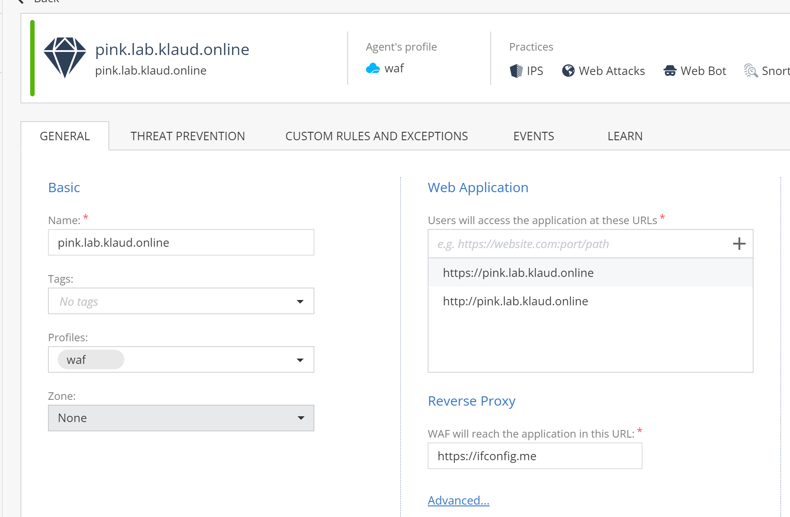

and add Host header with value `ifconfig.me`
Click `+` to add header before closing dialog with `OK`

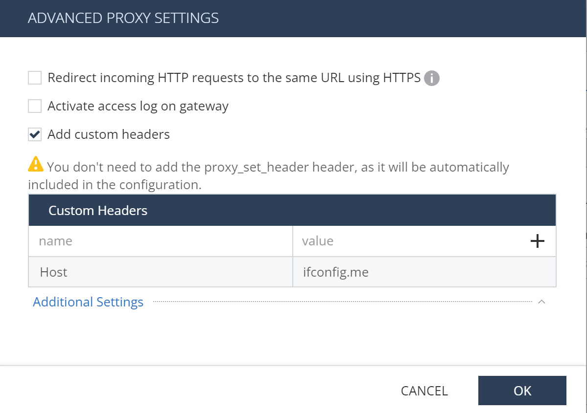

Remember to publish and enforce policy.

Policy version used (fetched by agents) is visible in [list of agents].

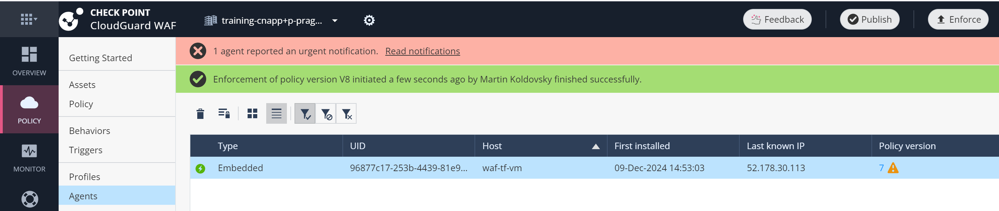

### Expected result

Now you may visit [https://pink.lab.klaud.online](https://pink.lab.klaud.online) in your browser:

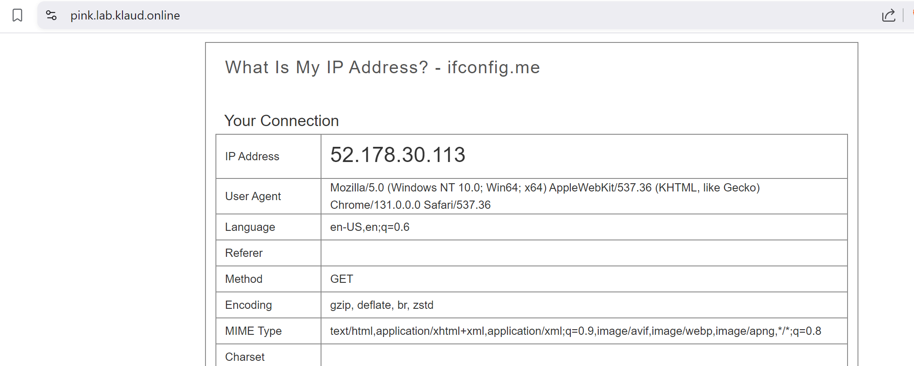

And you can even fake security incident:
[https://pink.lab.klaud.online?z=cat+/etc/passwd](https://pink.lab.klaud.online?z=cat+/etc/passwd)

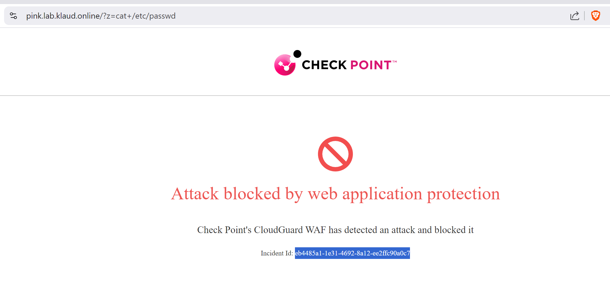

And look for incident details in logs under [Monitor section]https://portal.checkpoint.com/dashboard/appsec/cloudguardwaf#/waf-monitor/high-and-critical-wlc/)
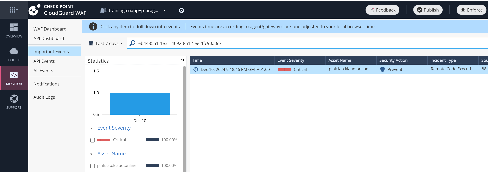

With more details on `attack indicators` and incident classification:
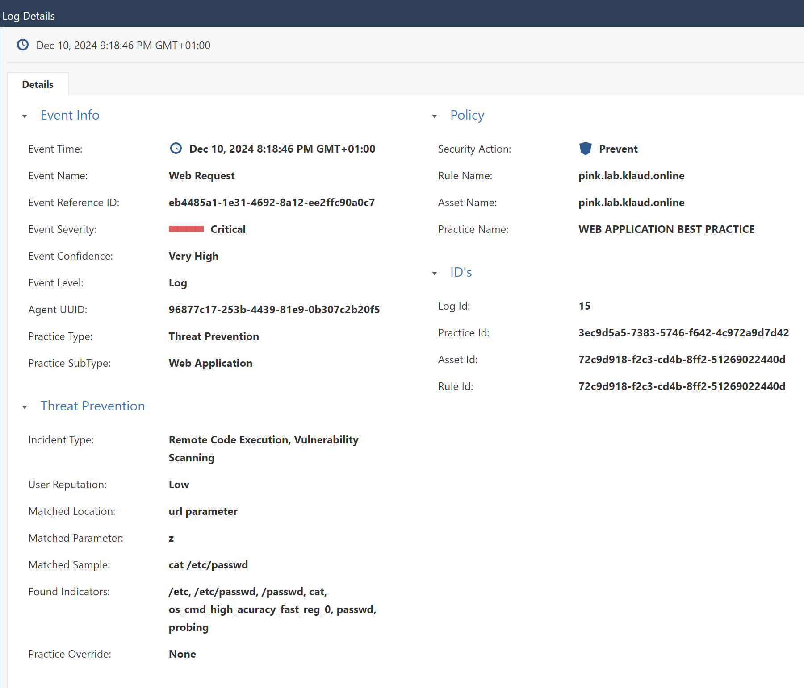