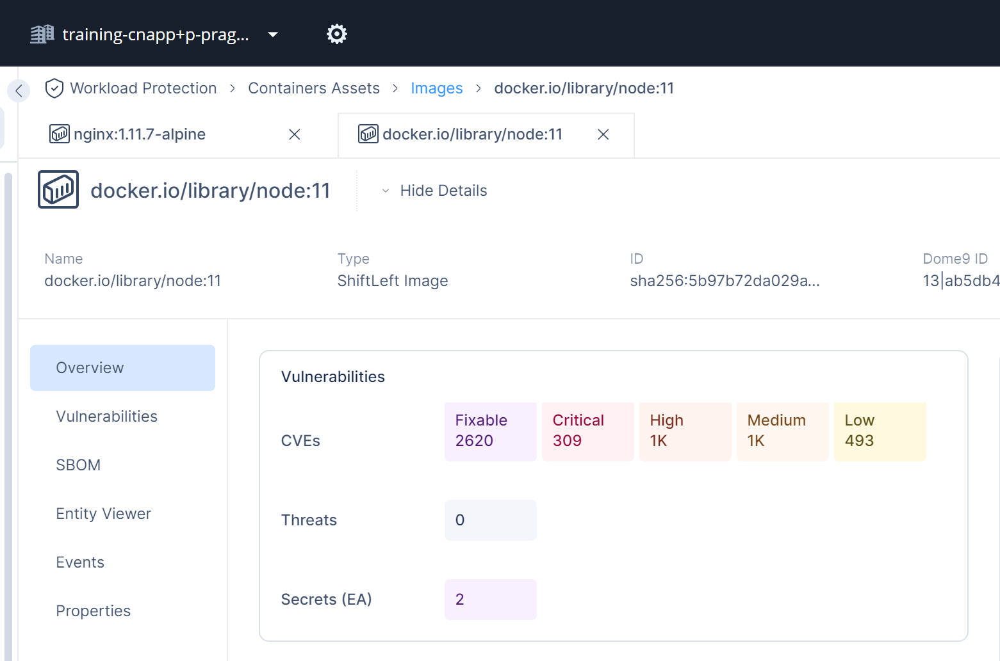

# Shift left scan of containers

This lab explains how to scan container images in CI/CD pipeline or manually and how to inspect results in ShiftLeft environment of CloudGuard CNAPP.

```shell
# lets start tmp folder and change to it
cd $(mktemp -d); pwd

# we will choose old version NodeJS image as investigation subject
export IMAGE="node:11"

# copy real credentials from 100-shiftleft-creds.sh on bit.ly/cp-cna***-training link 
export CHKP_CLOUDGUARD_ID=BringReal
export CHKP_CLOUDGUARD_SECRET=Secrets
export SHIFTLEFT_REGION=eu1
export SHIFTLEFT_ENV=ab5db4c6-a5cd-4b83-91ac-e2bd3e3cf14d

# we download image and save it as TAR file for our scanner
docker pull "$IMAGE"
docker save -o image.tar "$IMAGE"

# scanner is also distributed as Docker image checkpoint/shiftleft:latest_v2
# https://hub.docker.com/r/checkpoint/shiftleft/tags

# now we have image on disk, credentials in env vars
# so we can start the scan process

export SHARED_PATH=$(pwd)

docker run --rm -v ${SHARED_PATH}:/res -v ${SHARED_PATH}:/data -e CHKP_CLOUDGUARD_ID=$CHKP_CLOUDGUARD_ID -e CHKP_CLOUDGUARD_SECRET=$CHKP_CLOUDGUARD_SECRET -e SHIFTLEFT_REGION=$SHIFTLEFT_REGION -e SHIFTLEFT_ENV=$SHIFTLEFT_ENV checkpoint/shiftleft:latest_v2 shiftleft -D image-scan -j -i /data/image.tar -e $SHIFTLEFT_ENV -o /res/scan.json || true;

# expect results in scan.json in current folder
cat scan.json | jq .
cat scan.json | jq '. | keys'
cat scan.json | jq '.action'
cat scan.json | jq '.assessments[0] | .stats'

# we can also calculate link to CNAPP portal:

IMAGEID=$(curl -s --unix-socket /var/run/docker.sock "http://v1.43/images/$IMAGE/json" | jq -r '.Id'); echo $IMAGEID
SHORT_IMAGEID=$(echo $IMAGEID | cut -c 8-); 

echo; LINK="https://portal.checkpoint.com/dashboard/cloudguard#/workload/images/generic?cloudAccountId=$SHIFTLEFT_ENV&assetType=ShiftLeftImage&assetId=sha256%3A$SHORT_IMAGEID&tabName=overview&tabOnly=true&platform=shiftleft"; echo $LINK

# visit the link to see results
```

# Scan results in CNAPP

