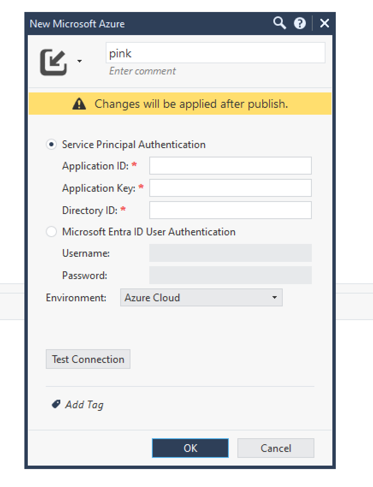

# Data Center Queries - consuming cloud inventory in Network Security policies

Open Smart-1 Cloud app in your [Infinity Portal](https://portal.checkpoint.com/dashboard/security-management) with `training-cnapp+p-prague` tenant.

You may easily start by opening Streaming Smart Console in browser - in [API & SmartConsole](https://portal.checkpoint.com/dashboard/security-management#/mgmt/qPAFNZTZGm8REQMrMyCHGE/config)

Choose `Open Streamed SmartConsole`

Check alias - color in `bit.ly/cp-cna***-training` dashboard.

### Adding Data Center representing Azure

* Above right objects pane choose New / Cloud / Data Center / Microsoft Azure:

Name DC based on your alias = color - e.g. `pink`

`104-azure-reader.json` on training dashboard `bit.ly/cp-cna***-training` has full Reader Service principal data:
* client_id = Application ID
* client_secret = Application Key
* tentant_id = Directory ID

Try `Test Connection`

Close and Publish policy to make `DC` active.

### Query Azure inventory using Data Center Qyery

* Above right objects pane choose New / Cloud / Data Center Query

* Name first query by your color and purpose `pink-vms`:

* Use "eye" icon to previw before and after completing Query Rules to see what objects in  Azure are matching.

### One more specific DC Query

* Above right objects pane choose New / Cloud / Data Center Query

* Name first query by your color and purpose `pink-linux-vms`
 
* Now be more specific by filtering VMs with tag `app` and value `linux1`:

