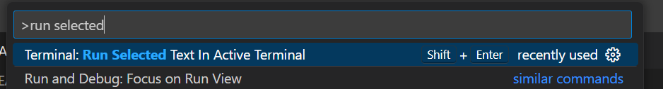

# CNAPP+P training labs

* follow [Kubernetes Security lab](./01-kubernetes-security/NOTES.md)

### Hint

It is possible to replace cut&paste of commands to Terminal from lab instructions using `Run Selected Text in Active Terminal` that is executing current line or selected text (e.g. multiple lines) by keyboard shortcut.

You may define such shortcut (we recoomend `Shift+Enter`) by pressing `Ctrl+Shift+P` for command palette, searching for `Run Selected` and clicking "settings wheel" icon.

